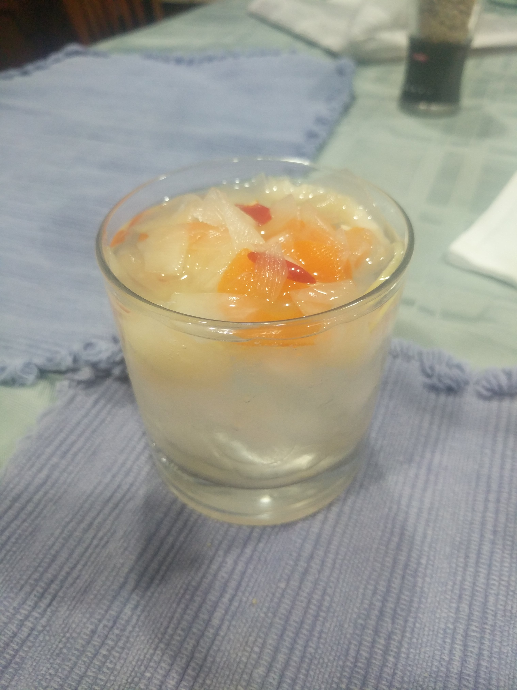

# Pickled Papaya Loki
My wife makes incredible Pickled Papaya.  I'll be linking the recipe from here, too, since you'll need to make it in order to make Pickled Papaya Lokis.  

## Ingredients
* Pickled Papaya
* Pickled Papaya Brine
* Gin
* Crushed Ice
* Dill Pickle

## Preparation
Fill an 8-oz tumbler glass with crushed ice to the brim.

Pour pickled papaya juice till it looks 1/4 to 1/3rd full. You'll notice that since the glass is filled with crushed ice, it gets full very quickly despite your not having added all that much olive juice -- be careful not to use too much or too little; Loki is all about balance. Fill the rest of the glass with Gin and stir it with a dill pickle.

## Gins

* New Amsterdam

## Photo

